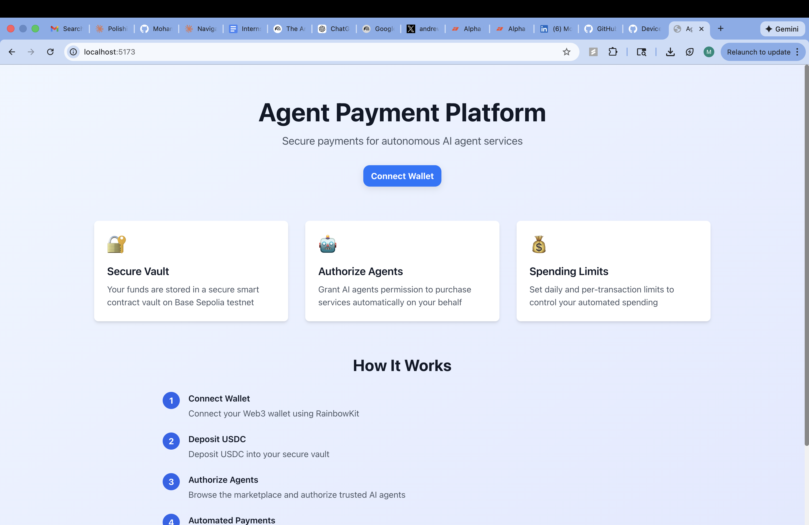

# AgentPay

An on-chain payment infrastructure that lets AI agents autonomously purchase services on behalf of funds. Funds deposit USDC into a vault, authorize agents (trading bots), and set spending limits — agents then make purchases within those limits without further manual approval.



## Architecture

```
agentpay/
├── contracts/   # Solidity smart contracts (Hardhat)
├── backend/     # REST API (FastAPI + SQLAlchemy)
└── frontend/    # Web app (React + Vite + wagmi)
```

### contracts/

Solidity 0.8.20 contracts deployed on Base and Arbitrum.

- `AgentPaymentVault.sol` — core vault: deposits, withdrawals, agent authorization, per-transaction and daily spending limits, platform fee routing
- `MockUSDC.sol` — ERC-20 mock for local development and testing
- Deployment scripts and a 50+ case Hardhat test suite

### backend/

FastAPI service for off-chain state that the contracts don't store.

- Fund and agent registry
- Transaction history indexing
- Wallet-signature authentication (eth-account)
- Async SQLAlchemy (SQLite in dev, PostgreSQL in production)
- Docker-ready

### frontend/

React 18 + Vite single-page app.

- RainbowKit wallet connection (MetaMask, WalletConnect, Coinbase Wallet)
- wagmi v2 hooks for all on-chain interactions (deposit, withdraw, authorize agent, set limits)
- Bot/agent marketplace
- Transaction history dashboard
- TailwindCSS responsive UI

## Supported Networks

| Network          | Chain ID |
|-----------------|----------|
| Base Mainnet    | 8453     |
| Base Sepolia    | 84532    |
| Arbitrum One    | 42161    |
| Arbitrum Sepolia| 421614   |

## Quick Start

### 1. Contracts

```bash
cd contracts
npm install
cp .env.example .env   # fill in PRIVATE_KEY and RPC/API keys

# Run tests
npm test

# Deploy to Base Sepolia
npm run deploy:base-sepolia
```

### 2. Backend

```bash
cd backend
python -m venv venv && source venv/bin/activate
pip install -r requirements.txt
cp .env.example .env   # fill in CONTRACT_ADDRESS after deploying

uvicorn app.main:app --reload --host 0.0.0.0 --port 8000
```

API docs available at `http://localhost:8000/docs`.

### 3. Frontend

```bash
cd frontend
npm install
cp .env.example .env   # add VITE_WALLETCONNECT_PROJECT_ID

npm run dev
```

App runs at `http://localhost:5173`.

## How It Works

1. **Fund deposits USDC** into the vault contract and authorizes one or more agents.
2. **Fund sets limits** — a daily cap and a per-transaction cap for each agent.
3. **Agent calls `purchaseOnBehalf()`** — the contract validates authorization and limits, deducts a configurable platform fee (default 2%), and transfers USDC to the service provider.
4. **Backend records** the transaction; the frontend shows it in the history dashboard.

## Security

- Reentrancy protection via OpenZeppelin `ReentrancyGuard`
- Fund balances are isolated — no cross-fund access
- Solidity 0.8.20 built-in overflow/underflow protection
- Daily limits reset automatically; per-transaction cap enforced on every call
- Platform fee capped at 10% in the contract

## Environment Variables

Each package has a `.env.example` documenting the required variables. Copy it to `.env` and fill in your values — **never commit `.env`**.

## License

MIT
